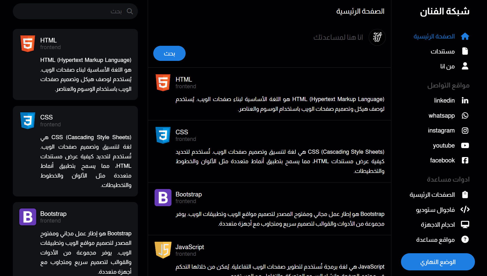

<h1 align="center">The Artist Web</h1>

  Welcome to Book Me, my platform that showcases my Frontend development expertise. The site is built using modern technologies including HTML, CSS, Bootstrap, JavaScript, OOP, TypeScript, JSON, API, Vue.js, React.js, Angular, Git, and GitHub. The site features a responsive and attractive design, with optimized performance to ensure a smooth and fast user experience. Enjoy browsing the site and discover the beauty and simplicity of advanced programming.

<h1 align="left">Skills:</h1>

  
  
  
  
  
  
  

<h2>Demo Shots:</h2>
